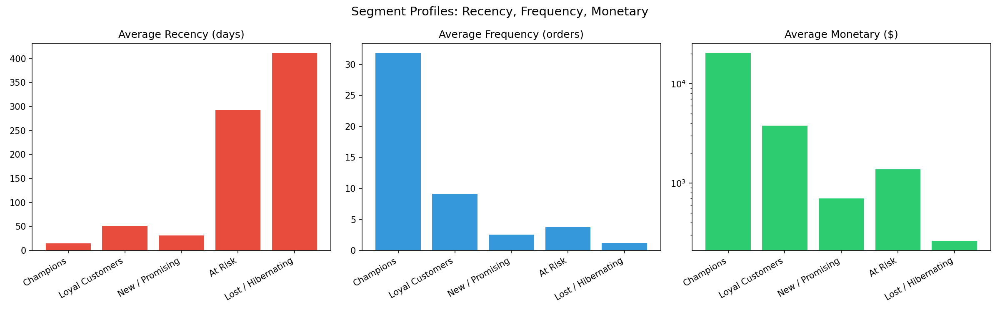
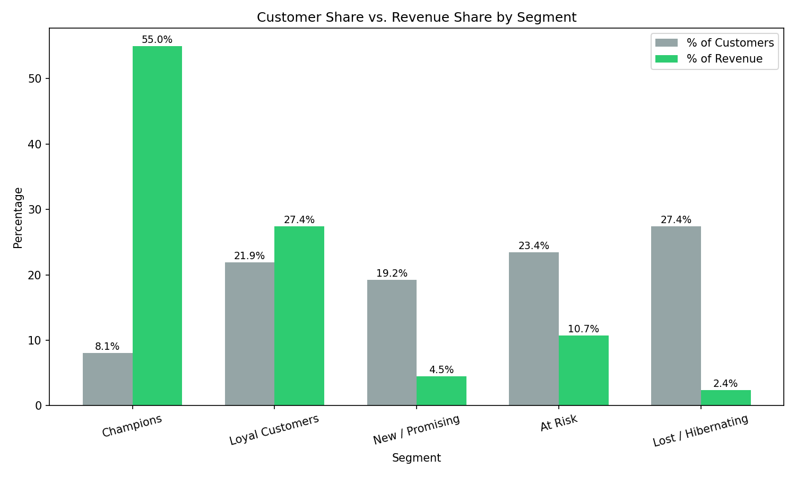
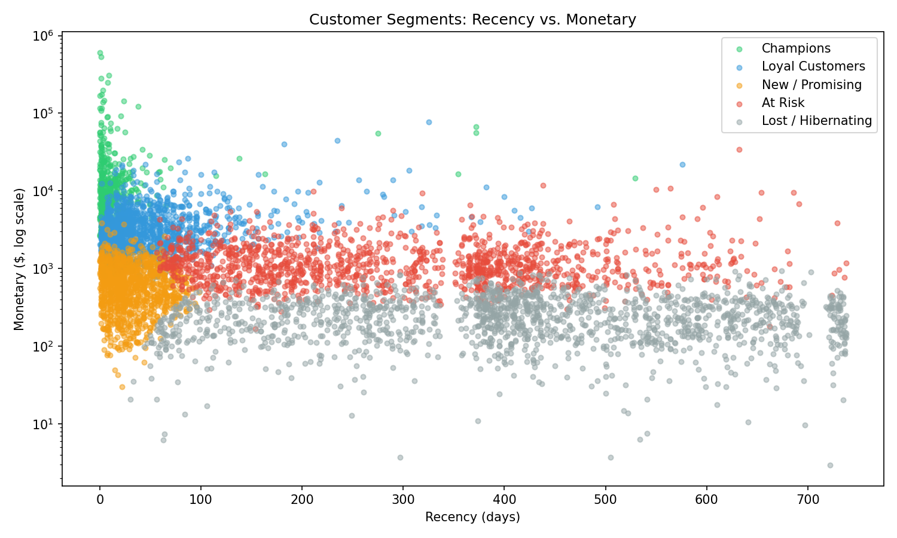

# Customer Segmentation & Retention Analysis

## Business Question
Which customers are most valuable, which ones are at risk of churning, and how should a business prioritize retention efforts across different customer types?

## About This Project
I built this project to practice end-to-end customer segmentation using RFM (Recency, Frequency, Monetary) analysis and K-means clustering. I wanted to go beyond just running the standard tutorial approach — so throughout this project I tried to validate my work at every step rather than trust the first result I got.

## Dataset
[Online Retail II](https://www.kaggle.com/datasets/mashlyn/online-retail-ii-uci) — transaction data from a UK-based online gift-ware retailer, Dec 2009–Dec 2011. I cleaned the raw 1,067,371 transactions down to 804,824 usable rows across 5,855 customers. Full cleaning logic is in `cleaning_script.py`.

## What I Did

**1. Data cleaning.** I investigated every anomaly I found instead of applying blanket rules — missing Customer IDs, cancelled orders, administrative stock codes, and what looked like duplicate rows. On that last one, I initially assumed duplicates should just be dropped, but when I actually looked at the data, I found they were mostly genuine repeated purchases within the same order, not export errors — so dropping them would have undercounted real revenue. I kept them instead.

**2. RFM feature engineering.** I calculated Recency, Frequency, and Monetary two separate ways — once in SQL and once in pandas — specifically to cross-check my own work. I actually found a real discrepancy between the two (SQL's date function compares calendar dates only, pandas' calculates exact elapsed hours), which I had to investigate and explicitly decide which version to use as final.

**3. Clustering.** I log-transformed and scaled the RFM features, then tested K values from 2 to 10 using both the elbow method and silhouette score. The two metrics actually disagreed — silhouette scored K=2 highest, but I chose K=5 instead because it produced segments that were actually useful for the business question, not just mathematically "cleanest." I verified this choice by checking that customers I already knew were wholesale-scale buyers (from manually investigating their order history) landed in the segment I expected.

**4. Naming and interpreting the segments** — turning cluster numbers into labels a business person could actually use, with a specific recommended action for each.

## Customer Segments

| Segment | % of Customers | % of Revenue | Avg Recency | Avg Frequency | Avg Monetary |
|---|---|---|---|---|---|
| Champions | 8.1% | 55.0% | 15 days | 32 orders | $20,488 |
| Loyal Customers | 21.9% | 27.4% | 51 days | 9 orders | $3,765 |
| New / Promising | 19.2% | 4.5% | 31 days | 2.5 orders | $699 |
| At Risk | 23.4% | 10.7% | 293 days | 3.7 orders | $1,376 |
| Lost / Hibernating | 27.4% | 2.4% | 411 days | 1.2 orders | $260 |

## What I Found Most Interesting

**Revenue concentration.** Just 8.1% of customers (Champions) generate 55% of total revenue. I wasn't expecting the split to be quite this extreme when I started — it's a strong, real example of the Pareto principle showing up in actual data, not just something I'd read about.

**The clusters actually look separated, not just statistically.** When I plotted every customer by Recency and Monetary, colored by their assigned segment, the groups visually separate with very little overlap. That was a good sanity check — it's one thing for a silhouette score to say the clusters are "good," it's another to actually see it.

**I didn't have to manually flag wholesale accounts.** Early on I found a few customers who were clearly businesses, not individuals (one had 145 orders averaging over 700 units each). I considered writing a rule to filter them out before clustering, but decided instead to see if K-means would separate them on its own. It did — those exact customers ended up in the Champions cluster without me telling the model anything about them being "different." That felt like a good validation that the clustering was picking up on something real.

## What I'd Do Differently / Next Steps
- The Champions segment is really a mix of high-value individuals and wholesale/B2B accounts — with more time, I'd want to split these further, since a wholesale account and a loyal individual customer probably need different outreach.
- I'd like to add a time-based validation — checking whether these segments stay stable if I rebuild them using only the first 18 months of data, to see if the clustering is robust or just fitting to this specific dataset.

## Files
- `notebook.ipynb` — the full analysis, in order, with my notes on each decision
- `cleaning_script.py` — data cleaning logic
- `customer_segments.csv` — every customer with their assigned segment
- `segment_summary.csv` — segment-level totals and percentages
- `segment_scatter.png`, `segment_revenue_share.png`, `segment_profiles.png` — the three charts above

## Tools Used
SQL (DuckDB), Python (pandas, scikit-learn, matplotlib), statistical validation by cross-checking calculations two different ways.
